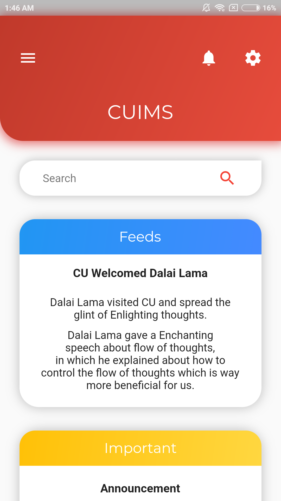
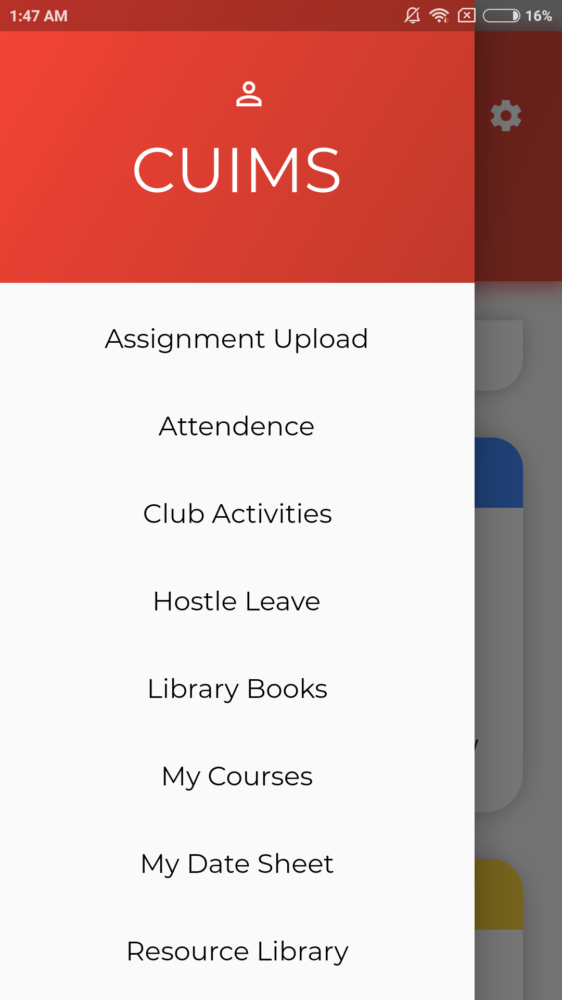
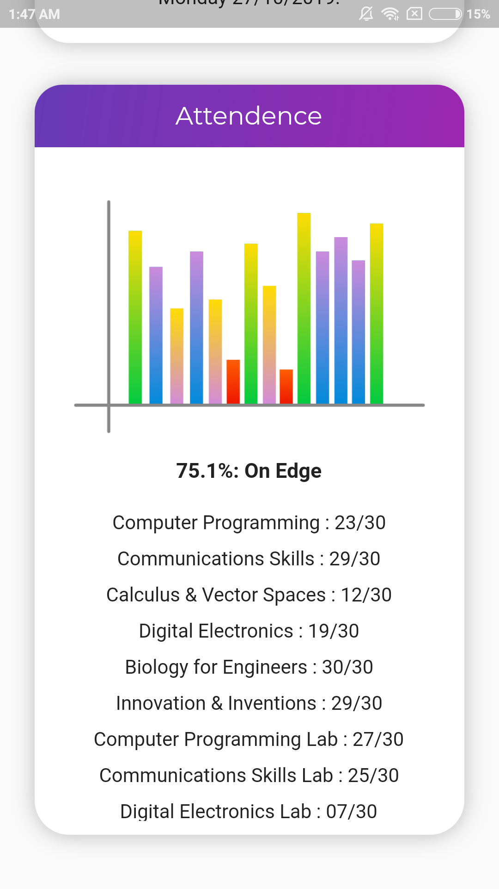

# CUIMS

Chandigarh University Information Management System UI App.

## Description

This is CUIMS UI app, which consists of home page and a app drawer. It is a beginner project in which basic implementation of widget in flutter is shown. Everything in this app has been made using widgets provided by flutter material package, no additional dependency is used.

### Screenshots

